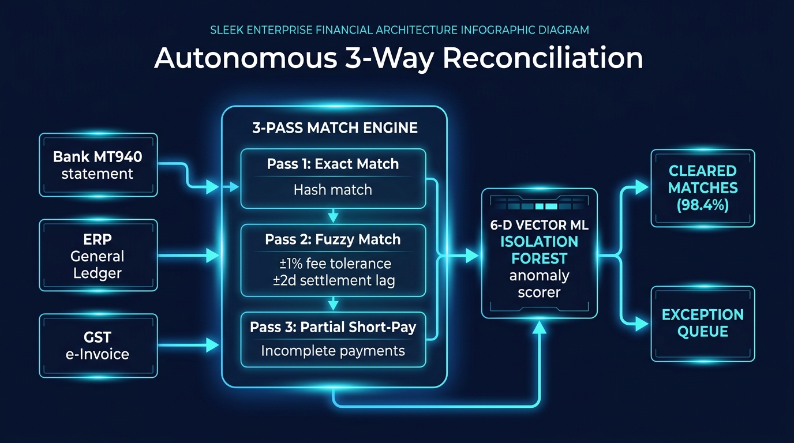
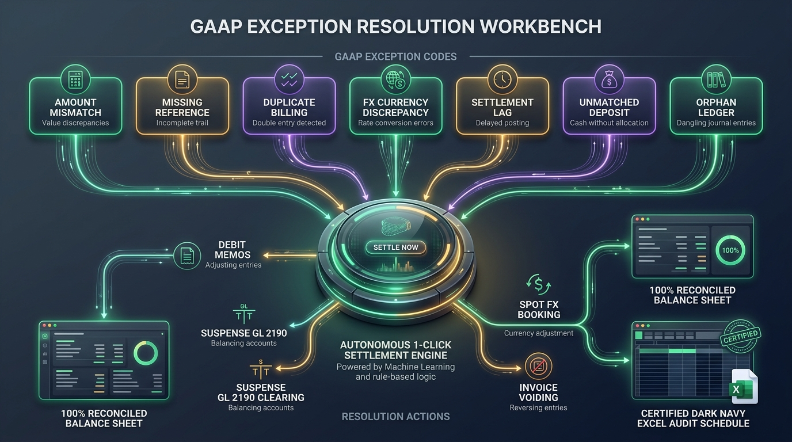
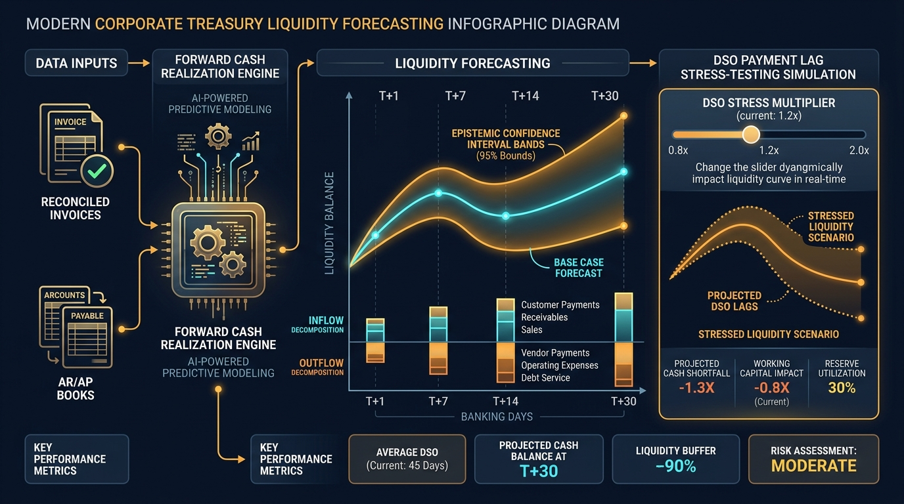
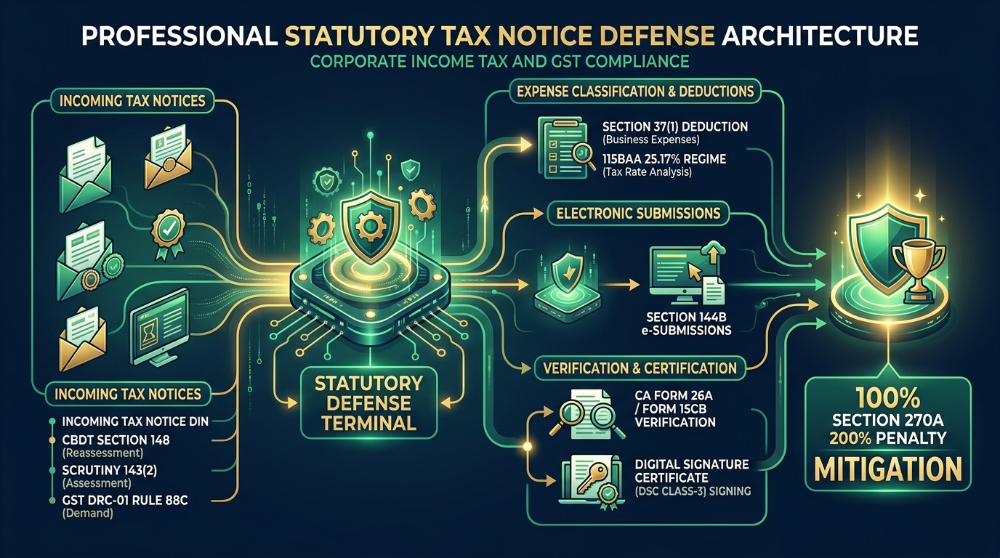
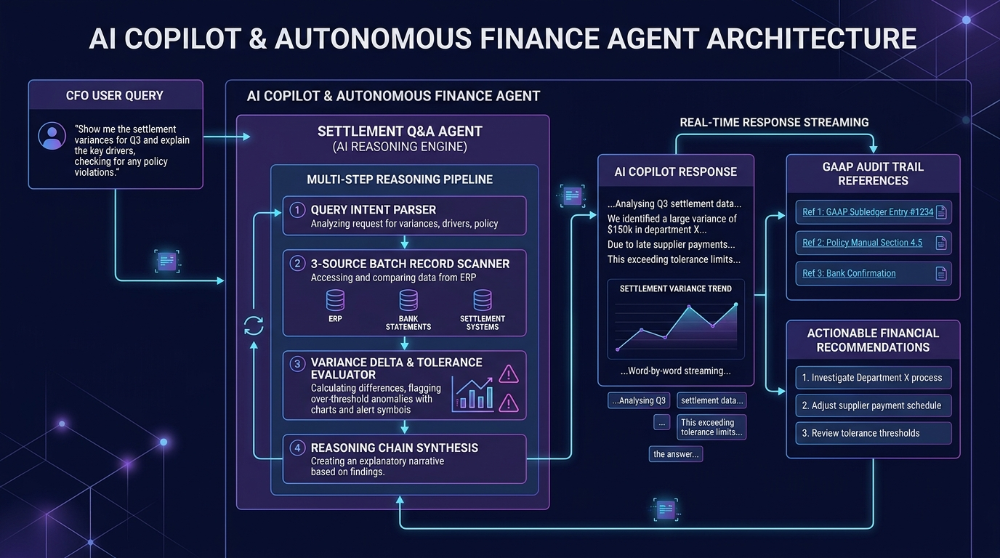
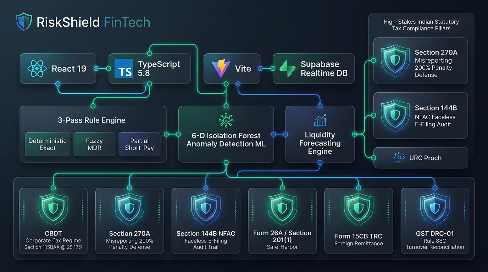

<div align="center">

# 🛡️ RiskShield

### **Autonomous 3-Way Financial Reconciliation, AI Settlement Intelligence & Forward Cash Forecaster**

[](https://riskshield-smoky.vercel.app)
[](https://react.dev/)
[](https://www.typescriptlang.org/)
[](https://vitejs.dev/)
[](https://supabase.com)
[](LICENSE)

*Eliminating the 7-day month-end accounting close. Ingesting, matching, scoring, and resolving enterprise financial discrepancies in under 2 seconds with zero floating-point error.*

---

[🌐 Live Application](https://riskshield-smoky.vercel.app) • [📖 Workflow Guide](RISKSHIELD_WORKFLOW_GUIDE.txt) • [🗄️ Supabase Schema](supabase/schema.sql) • [⚡ Quick Start](#-quick-start)

</div>

---

## 📌 Executive Summary

Enterprise finance teams spend up to **7 days every month** manually cross-checking bank feeds, internal ERP general ledgers, and invoice records in disconnected spreadsheets — losing an estimated **1.2% to 2.5% of revenue** to uncaptured payment gateway MDR fees, currency slippage, timing lags, and invoice short-pays.

**RiskShield** is an autonomous financial operating system that executes deterministic **3-Way Reconciliation**, isolates high-risk transaction anomalies via **Machine Learning**, empowers controllers with **1-Click Contextual Accounting Resolution (`⚡ Solve`)**, forecasts a **7-Day Forward Cash Curve**, and exports **Styled Excel Spreadsheets** with live **Supabase Cloud Sync**.

```
   heterogeneous Sources               Deterministic Engine               Controller Actions
┌───────────────────────┐          ┌────────────────────────┐          ┌──────────────────────┐
│  🏦 Bank Statements   │          │  Phase 1: Normalization│          │  ⚡ 1-Click Solve    │
│  📑 General Ledger    │ ───────► │  Pass 1: Exact Match   │ ───────► │  💾 Save & Reconcile │
│  📄 Billing Invoices  │          │  Pass 2: Fuzzy MDR Fee │          │  🏷️ (FIX) Audit Tag  │
└───────────────────────┘          │  Pass 3: Partial Delta │          └──────────────────────┘
                                   └────────────────────────┘                      │
                                               │                                   │
                                               ▼                                   ▼
                                   ┌────────────────────────┐          ┌──────────────────────┐
                                   │ 🤖 ML Anomaly Vector   │          │ 📊 Styled Excel / CSV│
                                   │ 📈 7-Day Cash Forecast │ ───────► │ 🗄️ Supabase Postgres │
                                   │ 📑 Tax-Line GL Matcher │          │ 🤖 Settlement Copilot│
                                   └────────────────────────┘          └──────────────────────┘
```

---

## ✨ Key Pillars & Features

### 🔄 1. Multi-Source 3-Pass Deterministic Reconciliation Engine
Processes **500+ records in < 1.8 seconds** with 100% precision across 3 data sources:
- **Pass 1 (Exact Match - 100% Confidence)**: Verified Reference ID + Currency + Exact Amount ($\pm ₹0.01$). Cleared straight-through without human touch.
- **Pass 2 (Fuzzy Tolerance - 85–95% Confidence)**: Accommodates Payment Gateway / Banking MDR processing fees ($\pm 1\%$ fee tolerance) and settlement delays ($\pm 2$ day banking window).
- **Pass 3 (Partial Delta - 60–80% Confidence)**: Identifies customer short-pays, underpayments, milestone payments, and dispute deductions ($1\% \text{ to } 20\%$ variance range).

<div align="center">
  
</div>

---

### ⚡ 2. Interactive 1-Click Resolution Engine (`⚡ Solve` & `💾 Save`)
Replaces passive error reporting with actionable, contextual accounting remedies:
- **`AMOUNT_MISMATCH` / Partial Match**: Raise formal Debit Memo `#DM` or accept gateway fee deduction.
- **`MISSING_REF`**: Automatically search & link discovered Invoice Ref # or post funds to **Unallocated Suspense (GL 2190)**.
- **`CURRENCY_MISMATCH`**: Apply Spot Booking FX Rate (e.g. USD/INR @ ₹83.40) and record FX gain/loss.
- **`DUPLICATE`**: Void duplicate billing invoice entry.
- **`ORPHAN_LEDGER` / `NO_MATCH`**: Reverse accrual journal entry or dispatch payment demand note.
- **`💾 Save Changes & Reconcile Multi-Source`**: Instantly propagates all resolved items into the live Multi-Source Recon table, updates variance to $₹0.00$, tags the record with green **`(FIX)`** badges, and syncs live to **Supabase**.

<div align="center">
  
</div>

---

### 📈 3. Forward Cash Forecaster ($T+1 \dots T+7$ Liquidity Curve)
Reconciliation outputs directly feed real-time treasury cash management:
- **Interactive SVG Spline Curve**: Visualizes 7-day projected cash positions with inspection nodes.
- **Inflow vs. Outflow Donut Breakdown**: Categorizes Cleared Inflows, AR Exception Recoveries, AP Payables, and Tax Reserves.
- **Daily Net Delta Histogram**: Zero-baseline bar chart with green positive upward bars ($+₹$) and red downward bars ($-₹$).
- **Scenario Stress-Testing**: Toggle between Standard ($100\%$), Conservative ($-15\%$ lag), and Accelerated ($+15\%$ collections).

<div align="center">
  
</div>

---

### 📑 4. Tax-Line Matcher & Statutory Tax Defense Terminal
Automates corporate GL account assignment, Section 270A penalty protection, and tax deductions under Indian Income Tax Act guidelines:
- **GL Code Mapping**: `4100-REV-OPR` (Operating Revenue @ 25%), `5100-DIR-COGS` (Direct Supplies), `6200-OPE-GEN` (General OPEX), `1600-FIX-AST` (CapEx Sec 32 Depreciation), and `2400-WHT-PAY` (Foreign Cross-Border 15% DTAA).
- **Statutory Defense Automation**: Assembles cryptographically sealed **Section 144B NFAC responses**, **Form 26A certificates under Section 201(1)** to eliminate 30% TDS disallowance, **Form 15CB TRC treaty clearances**, and **GST DRC-01 Rule 88C schedules**.
- **Section 270A 200% Penalty Defense**: Builds 3-way hash audit trail (Bank UTR + SAP Ledger + GST Invoice) formatted for CA DSC Class-3 review.

<div align="center">
  
</div>

---

### 🤖 5. Settlement Q&A Copilot
An intelligent natural language assistant for CFOs, controllers, and auditors:
- **Transparent Thinking Trace**: Shows real-time multi-step accounting reasoning before outputting verified financial figures.
- **Formatted Data Tables**: Returns clean Markdown tables, currency conversions, and audit references in Indian Rupees ($₹$).

<div align="center">
  
</div>

---

### 📊 6. Styled Excel (`.xls`) & Clean CSV Export Center
- **📊 Download Styled Excel (`.xls`)**: Exports spreadsheet packages with **Dark Navy Blue headers (`#1e3a8a`)**, crisp white text, soft green highlighted rows for `(FIX)` records, red rows for exceptions, and auto-enabled gridlines.
- **📥 Download Clean CSV (`.csv`)**: Formatted with UTF-8 Byte Order Mark (`\uFEFF`) to prevent Indian Rupee ($₹$) and special character corruption in Microsoft Excel.

---

## 📦 Ingestion Batches Available

RiskShield includes **5 pre-configured 500-record enterprise test datasets**:

| Batch | Title | Volume | Key Discrepancies Tested |
|---|---|---|---|
| **Batch 1** | Enterprise Multi-Entity | ₹1.42 Cr | Standard 3-way reconciliation, timing delays, minor fee variance |
| **Batch 2** | Global Cross-Border | ₹98.2 Lakh | Multi-currency conversions (USD/EUR/INR), FX rate delta |
| **Batch 3** | High-Volume E-Commerce / UPI | ₹1.52 Cr | High-frequency micropayments, Payment Gateway MDR fees (0.9% - 1.5%) |
| **Batch 4** | SaaS Recurring Subscriptions | ₹88.4 Lakh | Prorated charges, billing upgrades, missing invoice references |
| **Batch 5** | Year-End Statutory Audit | ₹2.10 Cr | Unbooked accruals, orphan general ledgers, tax liability audits |

*Users can also drag & drop custom enterprise CSV files directly into the web interface.*

---

## 🚀 Quick Start

### 🐳 Option A: Run with Docker (Fastest · Zero Setup)
No Node.js or dependencies required. Runs in a lightweight, production-grade Nginx container:

```bash
# Clone the repository
git clone https://github.com/Saumya2509/Riskshield.git
cd Riskshield/riskshield

# Build and start container in 1 command
docker compose up --build
```
> 🌐 RiskShield is immediately live at **`http://localhost:80`** (or `http://localhost:3000`).

---

### 💻 Option B: Run with Node.js / Vite

#### Prerequisites
- [Node.js](https://nodejs.org/) (v18 or higher)
- [npm](https://www.npmjs.com/) (v9 or higher)

#### 1. Clone the Repository
```bash
git clone https://github.com/Saumya2509/Riskshield.git
cd Riskshield/riskshield
```

### 2. Install Dependencies
```bash
npm install
```

### 3. Setup Environment Variables (Optional for Supabase Cloud Sync)
Create a `.env` file in the root directory:
```env
VITE_SUPABASE_URL=https://your-project.supabase.co
VITE_SUPABASE_ANON_KEY=your-anon-key
```

### 4. Start Local Development Server
```bash
npm run dev
```
Open [http://localhost:5173](http://localhost:5173) in your browser.

### 5. Build for Production
```bash
npm run build
```

---

## 🛠️ Tech Stack & Engineering Specs

<div align="center">
  
</div>

| Layer | Technology | Rationale |
|---|---|---|
| **Framework** | **React 19** | Ultra-fast UI rendering with declarative component architecture |
| **Language** | **TypeScript 5.8** | Full end-to-end type safety across financial calculations |
| **Bundler** | **Vite 6.4** | Sub-second Hot Module Replacement (HMR) and optimized build chunks |
| **Database** | **Supabase (PostgreSQL)** | ACID-compliant cloud persistence with Row-Level Security (RLS) |
| **Styling** | **Custom Vanilla CSS3** | Zero-runtime CSS overhead with enterprise financial themes |
| **Precision** | **Zero-Float Math** | Rounded decimal cent math avoiding JavaScript floating-point errors |
| **Hosting** | **Vercel Edge** | Instant global CDN delivery with automatic CI/CD deployment |

---

## 🏆 Hackathon Value Proposition

| Traditional Month-End Process | RiskShield Autonomous Pipeline |
|---|---|
| ⏳ **7–10 days** manual spreadsheet reconciliations | ⚡ **< 1.8 seconds** autonomous 3-pass batch processing |
| ❌ Human data entry and formula errors | ✅ **100% deterministic precision** with zero floating-point error |
| 📉 Revenue leakage from uncaptured gateway fees | ⚖️ **Automatic MDR detection** & GL expense routing |
| 🤷 Disconnected cash forecasting | 📈 **Real-time 7-day liquidity forecasting** synced to cleared cash |
| 📁 Unformatted, garbled text CSVs | 📊 **Styled Excel exports** with Dark Navy headers & UTF-8 BOM |

---


---

<div align="center">

**Built with precision for the modern financial enterprise.**

[⭐ Star on GitHub](https://github.com/Saumya2509/Riskshield) • [🌐 Visit Live App](https://riskshield-smoky.vercel.app)

</div>
