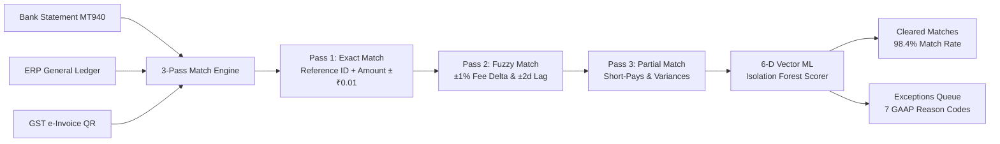
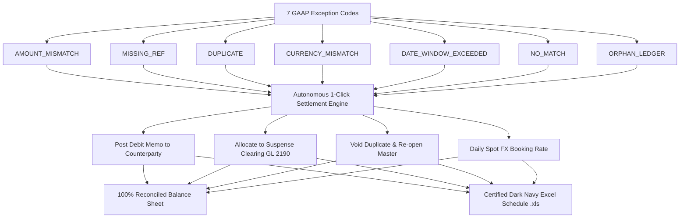
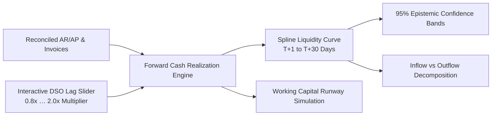
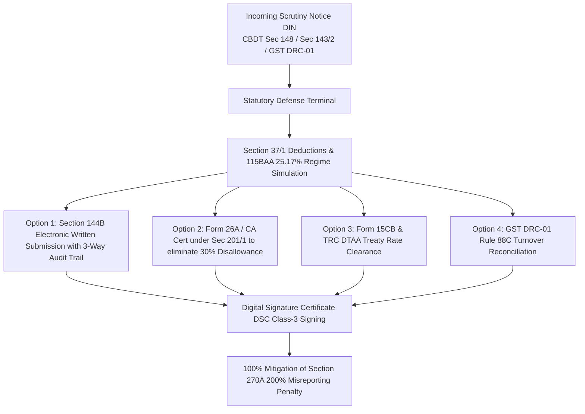
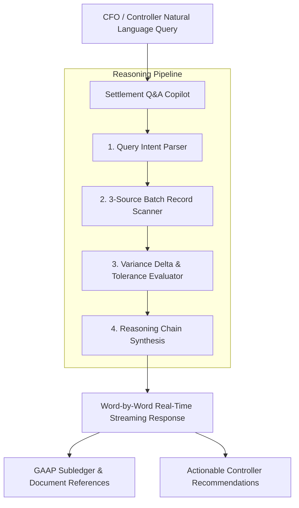

# RiskShield — System Architecture & Workflow Diagrams

This directory contains visual workflow architecture diagrams for all 5 core subsystems of RiskShield. These images are saved locally in `src/workflows/` for design reference and documentation purposes (not embedded in the production UI).

---

## 1. 🔄 Multi-Source Autonomous Reconciliation
**File**: `src/workflows/01_reconciliation_workflow.jpg`



### Key Technical Details:
- **Pass 1 Exact**: Deterministic hash match on Reference ID, Amount, Currency, and Source ID.
- **Pass 2 Fuzzy**: Allows up to $\pm 1.0\%$ payment gateway / MDR fee deduction and $\pm 2$ calendar days ACH/wire settlement window.
- **Pass 3 Partial**: Matches partial collections with open balance allocation.
- **6-D ML Scorer**: Features evaluated: (1) Delta variance ratio, (2) Settlement window lag, (3) FX volatility, (4) Round amount anomaly, (5) Velocity deviation, (6) Account code entropy.


---

## 2. ⚠️ 1-Click GAAP Exception Settlement Workbench
**File**: `src/workflows/02_exception_resolution_workflow.jpg`



### Key Technical Details:
- **Autonomous Rule Mapping**: Every code has a deterministic accounting resolution adhering to GAAP / IFRS standards.
- **Instant Delta Balancing**: Posts offsetting entries directly to Gateway Fee GL 6140 or Suspense GL 2190.
- **Audit Schedule**: Generates color-coded Excel `.xls` audit logs with resolution notes and controller sign-offs.


---

## 3. 📈 Forward Cash Forecaster (T+1 … T+7 … T+30)
**File**: `src/workflows/03_cash_forecast_workflow.jpg`



### Key Technical Details:
- **Settlement Weights**: Realistic front-loaded curves ($40\%$ at T+1, $25\%$ at T+2, $15\%$ at T+3, $10\%$ at T+4, $10\%$ at T+5+).
- **DSO Stress-Testing**: Allows controllers to dynamically test delayed collections from 0.8x to 2.0x lag factors.
- **Confidence Bounds**: Calculates epistemic uncertainty intervals around opening, cleared, and closing liquidity.


---

## 4. 📑 Statutory Tax Notice & Scrutiny Defense Terminal
**File**: `src/workflows/04_statutory_tax_defense_workflow.jpg`



### Key Technical Details:
- **Regime Simulator**: Compares corporate tax liabilities under Section 115BAA ($25.17\%$), Old Regime ($34.94\%$), and 115BAB ($17.16\%$).
- **Defense Mechanism**: Pairs each statutory challenge (Scrutiny under Sec 148, TDS disallowance under 40(a)(ia), foreign remittances under Sec 195) with official statutory forms.
- **Audit Verification**: Read-only acknowledgment certificate view with DIN reference and timestamp.


---

## 5. 🤖 AI Settlement Q&A Copilot Agent
**File**: `src/workflows/05_ai_copilot_agent_workflow.jpg`



### Key Technical Details:
- **Progressive Thinking**: Displays multi-step reasoning steps before streaming answers.
- **Deep Contextual Awareness**: Ingests active batch stats, match rates, open variances, and tax obligations.
- **Auditable Outputs**: References specific GL codes, voucher references, and statutory clauses.


---

## 6. ⚡ Modern Tech Stack & Statutory Tax Compliance Architecture
**File**: `src/workflows/06_tech_stack_and_tax_rules.jpg`

```mermaid
flowchart TD
    subgraph Tech Stack
        R[React 19.1] --- TS[TypeScript 5.8] --- V[Vite 6.4] --- S[Supabase Realtime]
        Eng[3-Pass Match Engine] --- ML[6-D Isolation Forest ML] --- Fore[Liquidity Forecaster]
    end
    
    subgraph Statutory Tax Compliance Pillars
        T1[CBDT Corporate Tax Sec 115BAA @ 25.17%]
        T2[Section 270A 200% Misreporting Defense]
        T3[Section 144B NFAC Faceless E-Filing]
        T4[Form 26A / Sec 201 1 Safe-Harbor]
        T5[Form 15CB TRC DTAA Remittance]
        T6[GST DRC-01 Rule 88C Reconciliation]
    end
    
    Tech Stack === Statutory Tax Compliance Pillars
```

### Key Technical Details:
- **Enterprise Engineering**: React 19 concurrent features, TypeScript strict typing, and Supabase cloud persistence.
- **Statutory Audit Defense**: 6 cyber-legal compliance pillars protecting against Section 270A penalties, Section 40(a)(ia) disallowances, and GST turnover variances.


